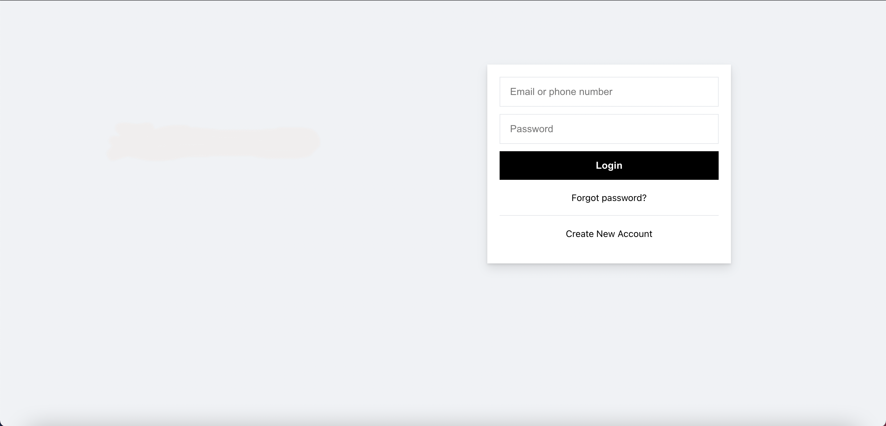
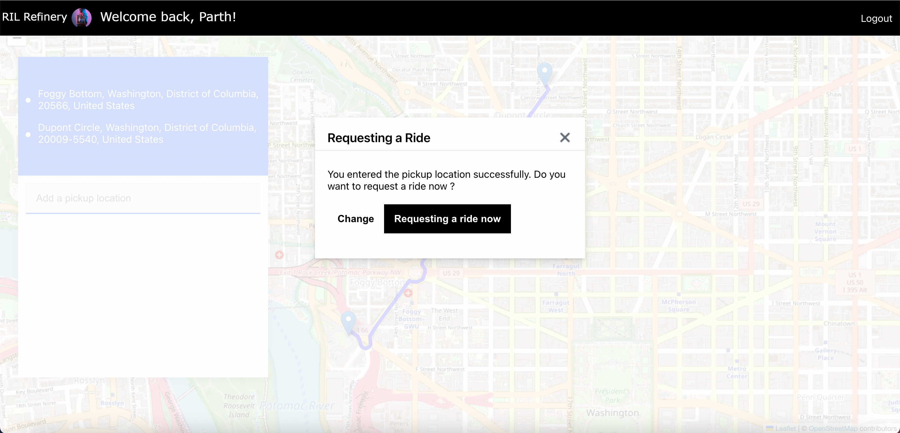
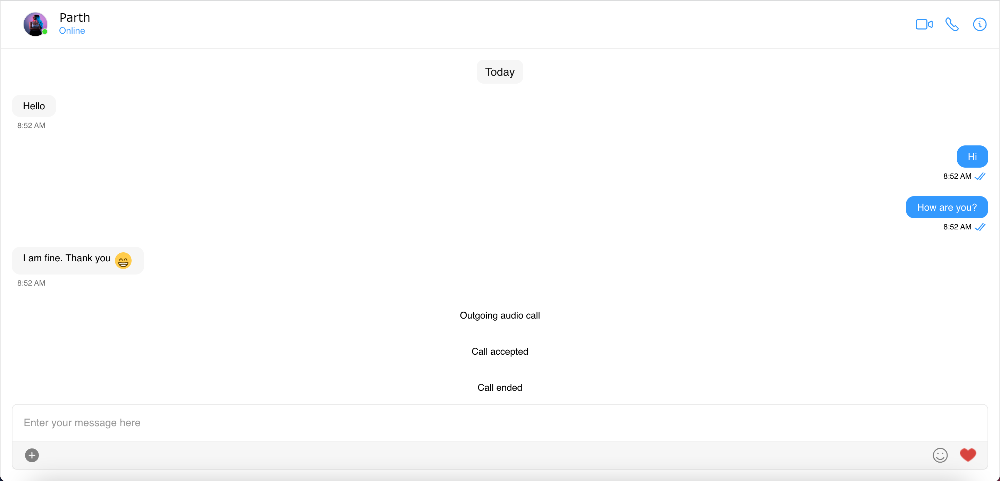

# Carpool Management System

One of the major forms of transport in an industrial complex consists of the private passenger car. These cars are generally used with only a single rider. Because of this, it leads to increased pollution, traffic congestion (Jam), parking space constraints, wastage of time and many such anomalies. Carpooling reduces each person’s travels costs such as fuel costs, tolls, and the stress of driving. Carpooling is one method that can be easily instituted and can help resolve a variety of problems that continue to plague urban areas, ranging from energy demands and traffic congestion to environmental pollution. Authorities often encourage carpooling, especially during high pollution periods and high fuel prices. The intent here is of making a web based application that will enable to let people know if vehicles are available for carpool in their desired path they can sign in for it. It will show the accurate time required to reach at particular location and would give a better way for pooling a car with a very efficient mapping system embedded into it for optimal routes for the employees. This Web-based application involves real time tracking of cars through GPS and works on logic of efficient and optimal allocation of vehicles to users taking into account the fuel and pollution constraints by allocation vehicles in a optimal fashion. All the cabs involved in this carpooling system are tracked through GPS in head office by the admin cell for safety and security of users, thus promoting safe carpooling culture for women as well.
Furthermore, carpooling has documented social and environmental benefits that include: Reducing traffic congestion as number of vehicles on the road can be reduced significantly, miles of travel of a particular vehicle and emission of gases by the vehicles can also be reduced. Thus it also helps in saving cost of building and maintaining infrastructure. 








## Run

To run the project follow these steps:

1. [Head to CometChat Pro and create an account](https://app.cometchat.com/signup)
2. From the [dashboard](https://app.cometchat.com/apps), add a new app called **"uber-clone"**
3. Select this newly added app from the list.
4. From the Quick Start copy the **APP_ID, APP_REGION and AUTH_KEY**. These will be used later.
5. Also copy the **REST_API_KEY** from the API & Auth Key tab.
6. Navigate to the Users tab, and delete all the default users and groups leaving it clean **(very important)**.
7. Download the repository [here](https://github.com/codecourses-site/uber-clone/archive/main.zip) or by running `git clone https://github.com/codecourses-site/uber-clone.git` and open it in a code editor.
8. [Head to Firebase and create a new project](https://console.firebase.google.com)
9. Create a file called **.env** in the root folder of your project.
10. Import and inject your secret keys in the **.env** file containing your CometChat and Firebase in this manner.

```js
REACT_APP_FIREBASE_API_KEY = xxx - xxx - xxx - xxx - xxx - xxx - xxx - xxx
REACT_APP_FIREBASE_AUTH_DOMAIN = xxx - xxx - xxx - xxx - xxx - xxx - xxx - xxx
REACT_APP_FIREBASE_DATABASE_URL = xxx - xxx - xxx - xxx - xxx - xxx - xxx - xxx
REACT_APP_FIREBASE_STORAGE_BUCKET =
  xxx - xxx - xxx - xxx - xxx - xxx - xxx - xxx

REACT_APP_COMETCHAT_APP_ID = xxx - xxx - xxx - xxx - xxx - xxx - xxx - xxx
REACT_APP_COMETCHAT_REGION = xxx - xxx - xxx - xxx - xxx - xxx - xxx - xxx
REACT_APP_COMETCHAT_AUTH_KEY = xxx - xxx - xxx - xxx - xxx - xxx - xxx - xxx
REACT_APP_COMETCHAT_API_KEY = xxx - xxx - xxx - xxx - xxx - xxx - xxx - xxx

REACT_APP_MAP_BOX_API_KEY = xxx - xxx - xxx - xxx - xxx - xxx - xxx - xxx
```

11. Make sure to exclude **.env** in your gitIgnore file from being exposed online.
12. Run the following command to install the app.

```sh
    npm install
    npm run start
```
